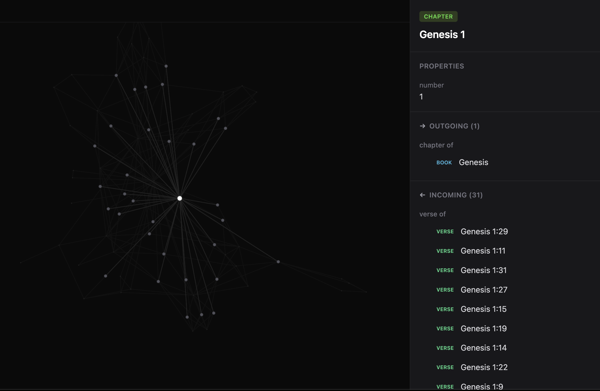

# Arkeon

A knowledge base that runs on your machine. Arkeon builds a structured knowledge graph that transcends individual repositories — connecting concepts, patterns, and relationships across all of your code and documents into one queryable graph.

<p align="center">
  
</p>

## Getting started

**1. Install Arkeon**

```bash
npm install -g arkeon
```

Requires Node.js 18.17+.

**2. Ingest a repo**

Open your AI coding assistant in any repository and run the ingest skill:

```
/arkeon-ingest
```

This starts Arkeon (if not already running), analyzes the codebase, and
builds a knowledge graph for it in its own space. The first run downloads
embedded Postgres and Meilisearch — cached after that.

Arkeon ships skills for [Claude Code](https://claude.ai/download),
[Cursor](https://cursor.com), and [Codex](https://openai.com/index/introducing-codex/).
Skills are installed automatically on first run.

**3. Ingest more repos**

Repeat step 2 in other repositories. Each repo gets its own space with
its own knowledge graph.

**4. Connect them**

Once you've ingested a few repos, run:

```
/arkeon-connect
```

This finds and creates relationships across spaces — shared concepts,
common patterns, dependencies between projects.

**5. Explore**

Open [http://localhost:8000/explore](http://localhost:8000/explore) to
see the graph explorer. Browse entities, traverse relationships, and
search across everything you've ingested.

## What you get

- **Knowledge graph** — entities (code, concepts, people, documents) connected by typed relationships
- **Graph explorer** — browser-based visualization at `/explore`
- **Full-text search** — powered by Meilisearch with typo tolerance and prefix matching
- **Spaces** — each repo gets its own space; `/arkeon-connect` links them together
- **REST API** — full CRUD for entities, relationships, spaces, and more
- **TypeScript SDK** — lightweight HTTP client ([`@arkeon-technologies/sdk`](packages/sdk-ts/))
- **Classification levels** — 5-tier access control (PUBLIC through RESTRICTED) enforced via Postgres RLS
- **Embedded infrastructure** — Postgres and Meilisearch managed automatically

## Using the CLI directly

The skills above (`/arkeon-ingest`, `/arkeon-connect`) are the recommended workflow, but you can also use the CLI directly:

```bash
arkeon init                # Generate secrets and state directory
arkeon up                  # Start the stack as a background daemon
arkeon status              # Check stack health
arkeon entities list       # List entities
arkeon search "query"      # Full-text search
arkeon down                # Stop daemon
arkeon reset               # Wipe data (keeps secrets)
```

All API endpoints are also available as CLI commands, auto-generated from the OpenAPI spec:

```bash
arkeon <resource> <action> [args]
arkeon entities create --type concept --properties '{"label":"distributed systems"}'
arkeon relationships list --source-id <id>
arkeon spaces list
```

## Reference

```bash
arkeon guide                      # Getting started tutorial
arkeon docs                       # Full CLI + API + SDK + Explorer reference
arkeon docs --format cli          # CLI commands only
arkeon docs --format api          # API reference (works offline, same as /llms.txt)
arkeon docs --format sdk          # SDK quick reference
arkeon docs --format explorer     # Explorer graph + screenshot server for agents
```

When the stack is running, the API is also self-documenting:

- [`/llms.txt`](http://localhost:8000/llms.txt) — full API reference optimized for LLM context windows
- [`/openapi.json`](http://localhost:8000/openapi.json) — OpenAPI 3.1 spec
- [`/help`](http://localhost:8000/help) — interactive guide
- [`/help/guide/explorer`](http://localhost:8000/help/guide/explorer) — explorer + screenshot server docs

## Configuration

All state lives in `~/.arkeon/` by default (override with `ARKEON_HOME`).
For external Postgres/Meilisearch and other configuration options, see
the [quickstart](docs/user/QUICKSTART.md).

## Advanced features

The knowledge extraction pipeline (LLM-powered auto-extraction from documents) and the sandboxed worker runtime (autonomous AI agents operating on the graph) are functional but under active development. See [docs/ADVANCED.md](./docs/ADVANCED.md).

## Development

### From a git checkout

```bash
git clone https://github.com/Arkeon-Technologies/arkeon
cd arkeon
npm install
npm run build -w packages/sdk-ts                # SDK must be built first
npm run build -w @arkeon-technologies/explorer  # Explorer assets
npx tsx packages/arkeon/src/index.ts start       # Foreground-attached stack
```

### Testing

```bash
npm run typecheck -w packages/arkeon   # Type checking
npm test -w packages/arkeon            # Unit tests
./scripts/test-local.sh                # Full: typecheck + unit + start + e2e
```

## Documentation

### For users

| Document | Description |
|----------|-------------|
| [Quickstart](docs/user/QUICKSTART.md) | Detailed install, configuration, and lifecycle commands |
| [Advanced features](docs/ADVANCED.md) | Knowledge pipeline, worker runtime, and other in-development features |

### For developers

| Document | Description |
|----------|-------------|
| [Architecture](docs/dev/ARCHITECTURE.md) | Package layout, request lifecycle, build pipeline |
| [Schema](docs/dev/SCHEMA.md) | Postgres tables, migrations, access control |
| [Auth](docs/dev/AUTH.md) | API key model and authentication |
| [Permissions](docs/dev/PERMISSIONS.md) | Classification levels and ACL grants |
| [Classification](docs/dev/CLASSIFICATION.md) | 5-tier read/write access control |
| [Filtering](docs/dev/FILTERING.md) | Query syntax for list endpoints |
| [Entity refs](docs/dev/ENTITY_REFS.md) | Entity reference conventions |
| [Ingest ops](docs/dev/INGEST_OPS.md) | Bulk ingestion via POST /ops |
| [Files](docs/dev/FILES.md) | Binary content storage (S3/local) |
| [Error contract](docs/dev/ERROR_CONTRACT.md) | JSON error response shape |
| [SDK](docs/dev/SDK.md) | TypeScript SDK usage |
| [Activity](docs/dev/ACTIVITY.md) | Mutation tracking and notifications |
| [Context management](docs/dev/CONTEXT_MANAGEMENT.md) | How the API self-documents for LLMs |
| [Agent runtime](docs/dev/AGENT_RUNTIME.md) | Worker sandbox design |
| [Runtime environment](docs/dev/RUNTIME_ENVIRONMENT.md) | Worker sandbox tools and packages |
| [Testing](docs/dev/TESTING.md) | Test structure and commands |

Design specs for planned features live in [docs/future/](docs/future/).

## License

Arkeon's core is licensed under the [Apache License, Version 2.0](./LICENSE). Arkeon is a trademark of Arkeon Technologies, Inc.

## Contributing

Contributions are welcome — see [CONTRIBUTING.md](./CONTRIBUTING.md). All contributors must sign our CLA, which is handled automatically by a bot when you open your first pull request.

## Security

To report a security vulnerability, see [SECURITY.md](./SECURITY.md).
